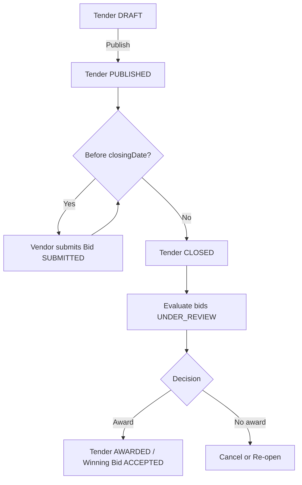
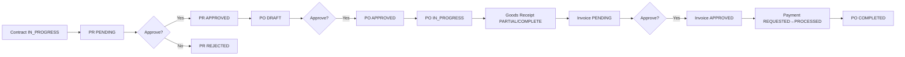

# Business Processes Guide

This document describes end-to-end business processes implemented by the e-procurement sourcing backend, mapping each step to roles, states, data models, approvals, and system behaviors.

- Core processes:
  - Tendering and Vendor Bidding
  - Procurement: Contract → Purchase Requisition (PR) → Purchase Order (PO) → Goods Receipt (GR) → Invoice → Payment
- Cross-cutting: Documents, Audit, Notifications, Events, and Multi-tenancy

---

## 1) Roles and Responsibilities

System roles (from schema `UserRole`):
- ADMIN: Governance, configuration, escalations; full access
- BUYER: Operates sourcing/procurement (creates contracts, PRs, POs, tenders)
- MANAGER: Approvals (PR/PO), oversight
- APPROVER: Additional or specialized approvals
- FINANCE: Invoice validation, payment approvals, disbursements
- VENDOR: External supplier; views published tenders, submits bids/quotations

RACI overview (typical; configurable per tenant):
- Tendering: BUYER (R/A), MANAGER (A), ADMIN (C), VENDOR (R for bid)
- PR: BUYER (R), MANAGER/APPROVER (A), ADMIN (C)
- PO: BUYER (R), MANAGER/APPROVER (A), VENDOR (C), FINANCE (C)
- GR: BUYER (R), MANAGER (A)
- Invoice: VENDOR (R), FINANCE (A/R)
- Payment: FINANCE (R/A), MANAGER (C)

---

## 2) Tendering and Vendor Bidding

Purpose: solicit vendor proposals/bids for goods/services under defined requirements and criteria.

Entities and states:
- Tender (TenderStatus): DRAFT → PUBLISHED → CLOSED → AWARDED | CANCELLED
- Bid (BidStatus): DRAFT → SUBMITTED → UNDER_REVIEW → ACCEPTED | REJECTED | WITHDRAWN
- Quotation (QuotationStatus): SUBMITTED → ACCEPTED | REJECTED | EXPIRED (optional use)

Key fields (schema reference):
- Tender: tenderNumber, title, description, requirements (Json), criteria (Json), estimatedValue, closingDate, evaluationMatrix (Json), contractId (optional), department/category
- Bid: bidAmount, technicalProposal (Json), financialProposal (Json), compliance (Json), encryptedData, technicalScore, commercialScore, totalScore, evaluatedAt/by
- Document: supports attachments across Tender/Bid with versioning and confidentiality flags

### 2.1 Process Steps

1. Initiation
   - Trigger: Business need or stemming from an existing Contract.
   - Actor: BUYER (or ADMIN). Creates a Tender in DRAFT with requirements and evaluation criteria (weights, max scores).
   - Outputs: Tender (DRAFT), initial Document(s) optional.

2. Internal Review and Approval (optional)
   - Actor: MANAGER/APPROVER validates scope, budget alignment.
   - Decision: Proceed to publish or revise DRAFT.

3. Publish Tender
   - Actor: BUYER/ADMIN sets status → PUBLISHED and sets closingDate.
   - System: Exposes tender to VENDOR role; emits "tender.published" event; logs audit.

4. Vendor Engagement (Q&A optional)
   - Actor: VENDOR reviews tender; may ask clarifications (outside scope or via future module); downloads documents.

5. Bid Preparation and Submission
   - Actor: VENDOR composes bid: technicalProposal, financialProposal, compliance, bidAmount.
   - Security: Sensitive contents may be encrypted (Mongo) with ENCRYPTION_KEY; checksums computed.
   - System: Creates Bid with SUBMITTED; records submittedAt; emits "bid.submitted".

6. Tender Closing
   - Trigger: closingDate reached or manual close.
   - Actor: BUYER/ADMIN sets Tender → CLOSED.
   - System: Blocks new submissions; emits "tender.closed".

7. Evaluation and Scoring
   - Actor: BUYER/ADMIN evaluates bids. Technical and commercial scores may use Go scoring service (JWT required).
   - System: Updates Bid → UNDER_REVIEW then ACCEPTED/REJECTED with evaluationNotes and totalScore; emits "bid.evaluated".

8. Award Decision
   - Actor: BUYER/ADMIN selects winning bid; sets Tender → AWARDED and winning Bid → ACCEPTED.
   - System: Optionally instantiates downstream procurement (PO) tied to Contract; emits "tender.awarded".

9. Post-Award
   - Actor: BUYER/FINANCE finalize commercial terms, attach documents, and proceed with PO.

### 2.2 SLA and Controls
- Publication window: minimum duration (configurable, e.g., `system_config.tender.min_duration_days`).
- Integrity: All edits logged in AuditLog; status transitions require role permissions.
- Confidentiality: Bid encryption; accessLevel and isConfidential on Document.
- Fairness: Evaluation criteria defined up-front; scoring traceability via evaluationNotes and timestamps.

### 2.3 Exceptions
- Cancellation: Tender → CANCELLED with reason; notify vendors; audit log + event.
- Withdrawal: Vendor may withdraw before closing; Bid → WITHDRAWN (business rule-dependent).
- Re-opening: Admin-only; resets status and dates, re-notify vendors.

### 2.4 Events (Outbox topics example)
- tender.created | tender.published | tender.closed | tender.awarded | tender.cancelled
- bid.submitted | bid.under_review | bid.scored | bid.accepted | bid.rejected | bid.withdrawn

### 2.5 High-level Flow

---

## 3) Procurement Workflow

Purpose: fulfill business need through controlled purchasing lifecycle.

Entities and states:
- Contract (ContractStatus): DRAFT → IN_PROGRESS → COMPLETED | CLOSED | TERMINATED
- Purchase Requisition (PRStatus): PENDING → APPROVED | REJECTED | CANCELLED
- Purchase Order (POStatus): DRAFT → APPROVED → IN_PROGRESS → DELIVERED → COMPLETED | CANCELLED
- Goods Receipt (GoodsReceiptStatus): PARTIAL | COMPLETE | REJECTED
- Invoice (InvoiceStatus): PENDING → APPROVED → PAID | OVERDUE | DISPUTED | CANCELLED
- Payment (PaymentStatus): REQUESTED → APPROVED → PROCESSED | FAILED | CANCELLED

Related models:
- Currency, POVendor (multi-vendor PO splits), Document, SystemConfig (thresholds), Notification, AuditLog

### 3.1 Process Steps

1. Contracting
   - Actor: BUYER/ADMIN drafts Contract with vendors, terms, deliverables, currency.
   - Status: DRAFT → IN_PROGRESS when active; vendor associations via ContractVendor.
   - Outputs: Contract baseline for PR/PO linkage, optional tender creation.

2. Purchase Requisition (PR)
   - Actor: BUYER creates PR (items, estimatedAmount, requiredBy, justification). Status PENDING.
   - Approval: MANAGER/APPROVER approves/rejects; thresholds from SystemConfig (e.g., `procurement.auto_approve_limit`).
   - Outputs: Approved PR; documents attached as needed.

3. Purchase Order (PO)
   - Actor: BUYER issues PO referencing PR or Contract; defines items, terms, amounts, vendors (POVendor for multi-vendor splits).
   - Status: DRAFT → APPROVED by MANAGER/APPROVER → IN_PROGRESS when issued to vendor.
   - Notifications: Vendor notified upon issuance.

4. Delivery and Goods Receipt (GR)
   - Actor: Receiving team/BUYER acknowledges deliveries; creates GR with receivedItems and inspection notes.
   - Status: PARTIAL until fully received; COMPLETE when satisfied; REJECTED if failed inspection.
   - Three-way match foundation (PO, GR, Invoice).

5. Invoicing
   - Actor: VENDOR submits Invoice referencing PO (and optionally GR); includes amounts, taxes, currency.
   - Actor: FINANCE validates; status PENDING → APPROVED.

6. Payment
   - Actor: FINANCE creates Payment (REQUESTED → APPROVED by FINANCE/MANAGER → PROCESSED upon disbursement).
   - System: Records references, method, and timestamps; can link to receiver (User) for confirmation.

7. Closure
   - PO: COMPLETED when items delivered and financials settled.
   - Contract: COMPLETED/CLOSED depending on fulfillment and term end.

### 3.2 Controls and Matching
- Approval chains: PR and PO require approvals per role and thresholds.
- Three-way match: Invoice must align to PO and GR quantities/amounts before approval (implementation policy per tenant).
- Currency handling: Currency model attached to PO/Invoice; exchangeRate optional; totals tracked.
- Documents: Attachments at each stage (specs, delivery notes, invoices, payment proofs); versioned.
- Audit: AuditLog captures create/update/approve/reject events with old/new values.

### 3.3 Exceptions
- PR/PO cancellation: Allowed before fulfillment; must state reason.
- GR rejection: Requires inspectionNotes and corrective actions; vendor notified.
- Invoice dispute: Status DISPUTED with notes; pauses payment.
- Payment failure: Status FAILED with retry or alternative method.

### 3.4 Events (Outbox topics example)
- contract.created | contract.updated | contract.closed
- pr.created | pr.approved | pr.rejected | pr.cancelled
- po.created | po.approved | po.issued | po.completed | po.cancelled
- gr.created | gr.completed | gr.rejected
- invoice.submitted | invoice.approved | invoice.paid | invoice.disputed
- payment.requested | payment.approved | payment.processed | payment.failed

### 3.5 High-level Flow

---

## 4) Documents and Records

- Document model supports versioning via parent/versions and typed relations (contractId, tenderId, bidId, etc.).
- Flags: isConfidential, accessLevel for sensitive content; mimeType, size, and tags for retrieval.
- Storage: File path references; for bids, sensitive payloads may be stored encrypted in Mongo collection.

---

## 5) Multi-tenancy and Security

- All core models carry tenantId; constraints ensure tenant data isolation.
- Role-based guards and CASL abilities enforce permissions per action and entity.
- Throttling: Per-role limits (ADMIN/USER/VENDOR) to protect APIs.
- JWT access and refresh tokens; httpOnly cookies for refresh; CORS and Helmet hardened defaults.

---

## 6) Notifications and Events

- Notifications: per-user entries (title, message, type, isRead) for approvals, status changes.
- Outbox pattern: durable event emission for integrations (Kafka-ready). Topics as listed in sections above.

---

## 7) KPIs and Operational Metrics

- Sourcing: number of tenders, average bids per tender, cycle time to award, win rate, vendor performance (onTimeDelivery, rating)
- Procurement: PR/PO approval cycle times, on-time delivery %, invoice approval latency, dispute rates, payment processing time
- Financial: spend by category/vendor, variance vs. contract, tax totals by currency

---

## 8) Compliance and Governance

- AuditLog: CREATE/UPDATE/DELETE/APPROVE/REJECT/SUBMIT/LOGIN/LOGOUT with timestamp, user, deltas.
- Soft deletes where applicable; retention policies (e.g., `AUDIT_LOG_RETENTION_DAYS`).
- Configurable workflows (WorkflowStep) per tenant: step order, assignedRole, approvalCount, conditions.

---

## 9) Step Checklists (Operational)

- Tender Publish Checklist
  - Requirements and criteria defined and reviewed
  - Dates set (publishedAt, closingDate)
  - Documents attached and classified
  - Approval captured (if applicable)

- Bid Evaluation Checklist
  - Technical/commercial scores filled and justified
  - Compliance confirmed; clarifications resolved
  - TotalScore computed; decision recorded
  - Audit and notifications sent

- PR Approval Checklist
  - Items/specifications complete; justification present
  - Budget availability verified; thresholds evaluated
  - Approver(s) sign-off recorded

- PO Issuance Checklist
  - Vendor(s) assigned (POVendor where split)
  - Currency/tax/total validated
  - Terms and delivery dates set; documents attached
  - Vendor notification sent

- GR Checklist
  - Quantities match; inspection outcome recorded
  - Discrepancies noted; partials tracked
  - Documents (delivery notes) attached

- Invoice and Payment Checklist
  - Three-way match verified (policy-dependent)
  - Taxes and totals correct; currency consistent
  - Approvals complete; payment method recorded
  - Remittance/receipt documented

---

## 10) Data Model Traceability

- Contract → PR → PO → GR/Invoice → Payment
  - schema: Contract.id → PR.contractId → PO.contractId → GR.poId / Invoice.poId → Payment.invoiceId/poId
- Tender → Bid → PO (post-award)
  - schema: Tender.id → Bid.tenderId; Award triggers PO creation linked to Contract (business policy)
- Vendor linkage throughout via Vendor.id and POVendor/ContractVendor relations
- Documents link at each entity level for full audit and evidence

---

## 11) Future Extensions

- Automated evaluation matrices with weighted scoring templates
- Vendor onboarding workflow and compliance checks
- Dynamic approval routing via WorkflowStep conditions
- Budget and GL integration; catalog/PIM integration
- Full-text search across documents and tenders
